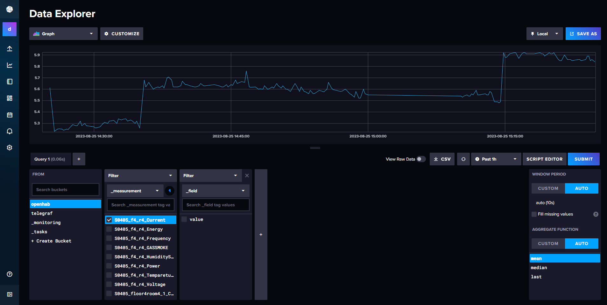
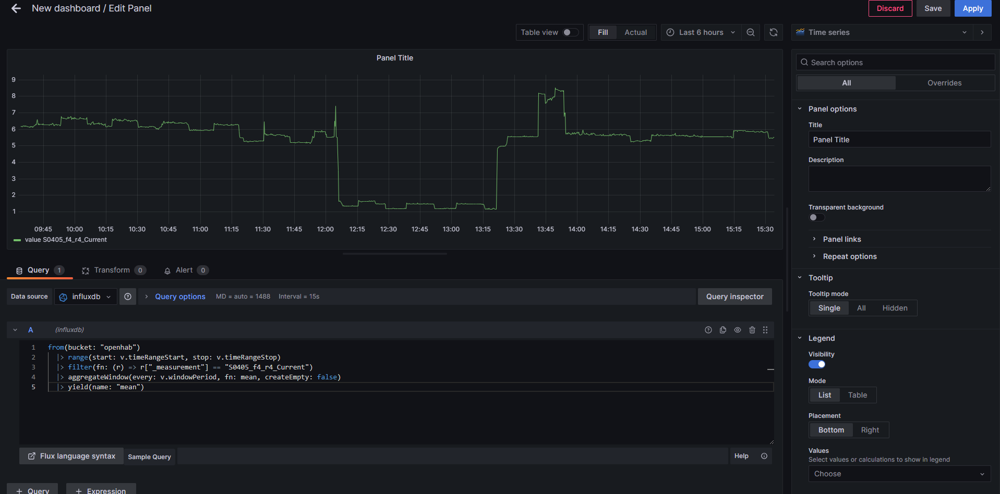

# How to create a Grafana dashboard
Grafana dashboards retrieve their data from InfluxDB. So, to create a Grafana dashboard, you need to write a Flux query that will retrieve the data you want.

## How to write a Flux request
It's easy. Go to the InfluxDB page of the project, then navigate to the "Data Explorer" section in the left-side menu. Next, select the bucket that contains the data you want. Here, it's "openhab". After that, choose the data you want:


Now click on the "Script Editor" button, and you can see your Flux query:
```py
from(bucket: "openhab")
  |> range(start: v.timeRangeStart, stop: v.timeRangeStop)
  |> filter(fn: (r) => r["_measurement"] == "S0405_f4_r4_Current")
  |> aggregateWindow(every: v.windowPeriod, fn: mean, createEmpty: false)
  |> yield(name: "mean")
```
## Create your dashboard
Now that you have your Flux query, you just need to create your dashboard. To do that, go to the Grafana page, then click "Dashboard," and then "New -> New Dashboard".<br>
Next, click on "Add Panel," and paste your Flux query into the field at the bottom of the page:



That's it! You have created your first Grafana dashboard.

## Long-life dashboard
Congratulations, you have created your first dashboard. But what happens if you lose its data? You will lose your dashboard because it is only stored on the server.<br>
The solution is to create a ".json" file that will contain your dashboard.
We are working on two different solutions for working with dashboards using JSON files.<br>
First, there's the "portable-dashboard." It's similar to the professional dashboards that you can find on the Official Grafana website. This type of dashboard can be imported into any Grafana project because the datasource is chosen by the user.<br>
The other type of dashboard is the "auto-imported dashboard." These dashboards are not portable, but they have the ability to be automatically imported into the project. You just need to put your dashboard into the "grafana/dashboards" directory. For example, we use it to easily import all the dashboards for the ECOMAS project.