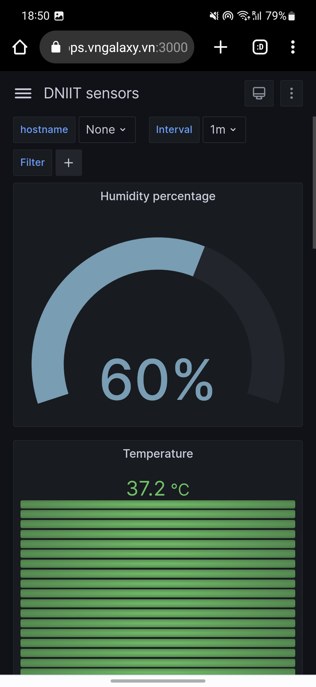
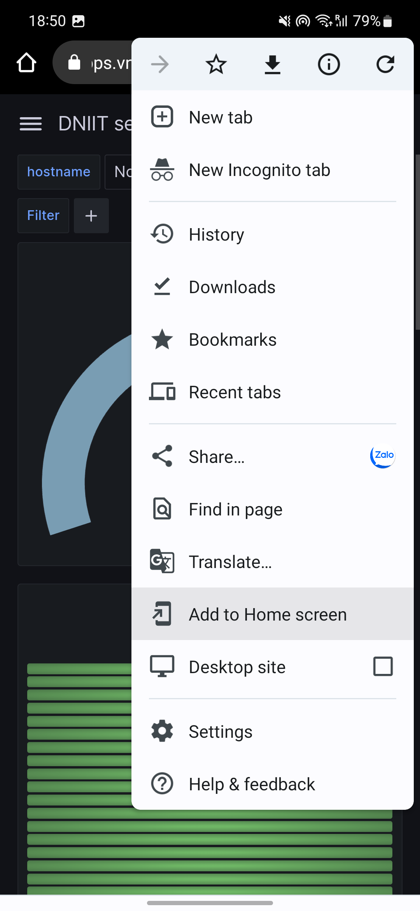

# Grafana

## Credentials

| username | password |
|----------|----------|
| admin    | admin    |
| user     | user     |

## Manual import of the home dashboard

Summary: import influxDB datasource then import the home dashboard

1. Open [Grafana (localhost:3000)](http://localhost:3000) or [Grafana (apps.vngalaxy.vn)](https://apps.vngalaxy.vn:3000)
2. Add the InfluxDB datasource :
   - Click on the gear icon on the left menu then click on `Data Sources`
   - Click on `Add data source`
   - Click on `InfluxDB`
      - Query language: `Flux`
      - HTTP
        - URL: `http://influxdb:8086` ou `https://apps.vngalaxy.vn:8086`
        - Leave the rest as default
       - Auth
         - Uncheck `Basic Auth`
       - InfluxDB Details
         - Organization: `dniit`
         - Token : `DOCKER_INFLUXDB_INIT_ADMIN_TOKEN` in `.env` file
         - Bucket: `openhab`
       - Click on `Save & Test`  
   - You should now see `✅ 4 buckets found`
3. Import the home dashboard :
   - Click on the four-squares icon on the left menu then click on `Browse`
   - Click on `Import`
   - Click on `Upload JSON file`
     - Choose the file `grafana/dashboards_(manual_import)/home_dashboard.json`
   - Chose the influxDB datasource you just created
   - Click on `Import`

## Manual import of the alerts

It is not possible to automatically import the alerts, so you have to do it manually : 

1. Open [Grafana (localhost:3000)](http://localhost:3000) or [Grafana (apps.vngalaxy.vn)](https://apps.vngalaxy.vn:3000)
2. Click on the bell icon on the left menu then click on `Alerting`
3. Click on `Alert Rules`
4. Click on `Create alert rule`
   1. Set an alert rule name 
      - Rule name: `Less than 1Go of free RAM`
   2. Set a query and alert condition
      - expression : 
      - `A` : `infludb`, `now-10m to now`
          ```
          from(bucket: "openhab")
              |> range(start: v.timeRangeStart, stop: v.timeRangeStop)
              |> filter(fn: (r) => r["_measurement"] == "system" and r["_field"] == "mem_free")
              |> aggregateWindow(every: v.windowPeriod, fn: mean, createEmpty: false)
              |> yield(name: "mean")
          ```
      - `B` : `Reduce`  
        Function : `Last` Input : `A`  
        Mode : `Strict`  
      - `C` : `Math`  
        Expression : `$B < 1000000000`
   3. Alert evaluation behavior
        - Folder : `Alerting`
        - Evaluation group (interval) : `1m`
        - For : `1m`
        - Alert state if no data or all values are null : `Alerting`
        - Alert state if execution error or timeout : `Alerting`
   4. Add details for your alert rule: nothing to do
   5. Notifications: nothing to do
   - Click on `Save and exit`
5. Go to the `Contact points` tab
   - Click on `Add contact point`
     - Name `Webhook alert`
     - Integration : `Webhook`
     - URL : `https://eombair37drklph.m.pipedream.net`
     - Click on `Test` if you want to try
   - Click on `Save contact point`

## Managing users

[Create users and teams - Grafana documentation](https://grafana.com/tutorials/create-users-and-teams/)

## Forgotten admin password

Source : [](https://community.grafana.com/t/default-admin-password-cant-login/37930/2)

- Open the Grafana bash using this command

```bash
docker exec -it grafana bash
```

- Then use this command 

```bash
grafana-cli admin reset-admin-password new_passwd
```

## Add Grafana as an App on your Smartphone 

|  |  |
|------------------------------------------------------------------------|------------------------------------------------------------------------|
